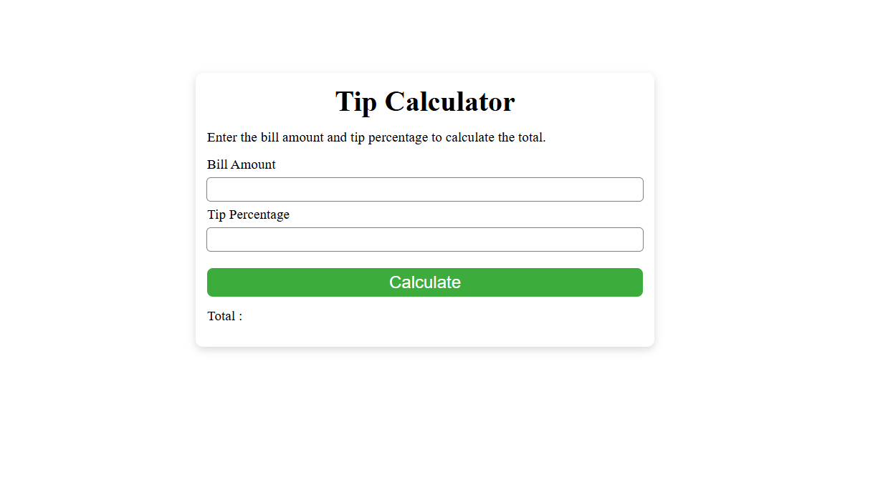

# Tip Calculator

A simple and user-friendly Tip Calculator built using HTML, CSS, and JavaScript.

## Features

- Calculate tip based on bill amount and tip percentage
- Displays the total amount including tip
- Prevents negative input values
- Clean and responsive design
- Shows results with two decimal places

## Technologies Used

- HTML5
- CSS3
- JavaScript

## How It Works

1. Enter the bill amount.
2. Enter the tip percentage.
3. Click the **Calculate** button.
4. The application will display the total amount including the tip.

### Formula Used

```text
Total Amount = Bill Amount + (Bill Amount × Tip Percentage / 100)
```

## Project Structure

```text
Tip-Calculator/
│
├── index.html
├── style.css
├── script.js
└── README.md
```

## Screenshot

## Screenshot



## Live Demo

Add your GitHub Pages link here.

## Future Improvements

- Custom tip buttons (10%, 15%, 20%)
- Bill splitting between multiple people
- Dark mode
- Better input validation

## Author

Hemant Kumar

Built as a JavaScript practice project while learning web development.